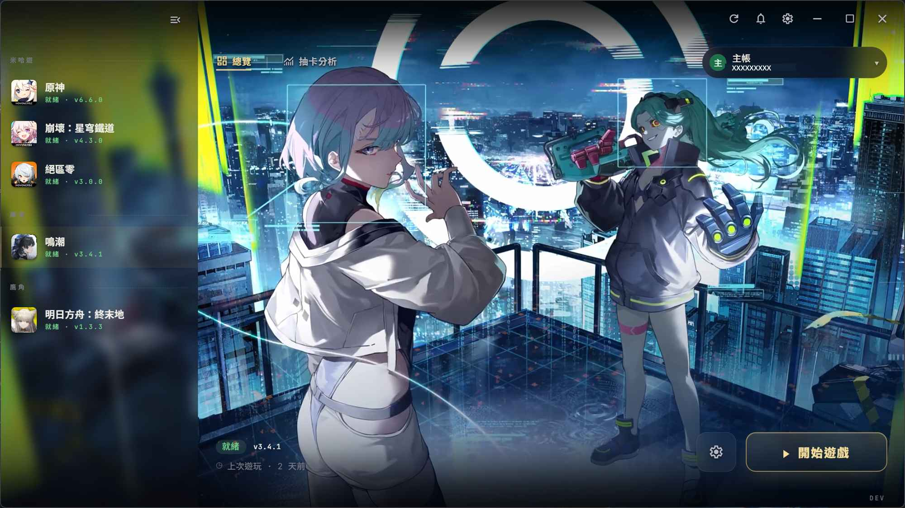
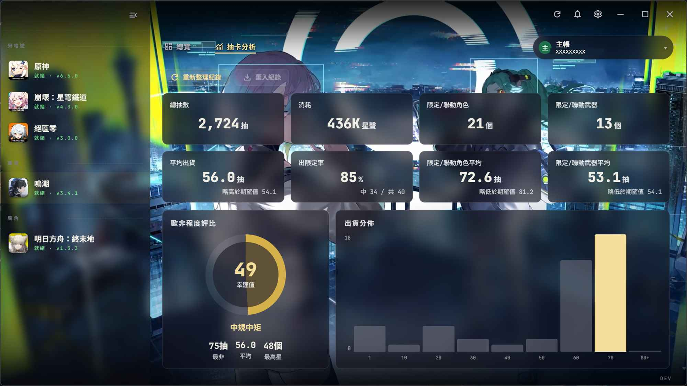
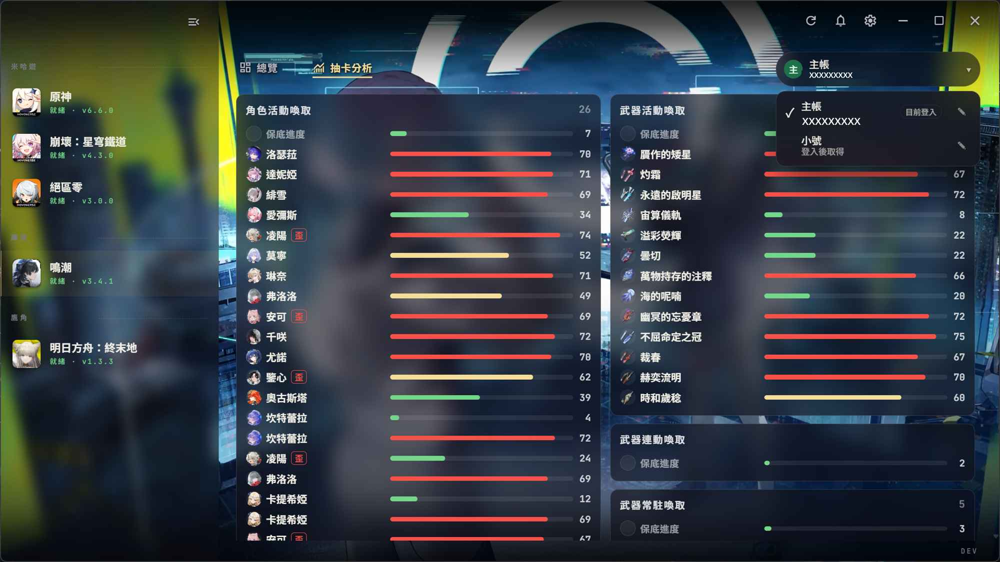

<p align="center">
  
</p>

<h1 align="center">Omnigate</h1>

<p align="center">繁體中文 README: <a href="README.md">README.md</a></p>

Unified desktop launcher for several Chinese live-service games (Genshin Impact / Honkai: Star Rail / Zenless Zone Zero / Wuthering Waves / Arknights: Endfield / Neverness to Everness).

One library for every launcher: per-game install detection, updates & pre-download, last-played, and a per-account **gacha analysis** dashboard (per-banner record panels, limited character/weapon expected cost, pity progress, luck rating, pull distribution, 50/50-loss markers, and character/weapon icons on high-rarity records).
**Status:** v0.4.0 — work in progress.

## Screenshots

**Home — game library & key-art**



**Gacha analysis — per-account dashboard (1)**



**Gacha analysis — per-account dashboard (2)**



## Tech

Go + [Wails v2](https://wails.io) (Windows / WebView2), Vue 3 + Pinia frontend, SQLite for gacha records.

## License & references

- **License:** [AGPL-3.0](LICENSE).
- Protocol behavior referenced from [Collapse Launcher](https://github.com/CollapseLauncher/Collapse) (AGPL-3.0).
- HDiff patches via bundled [`hpatchz`](https://github.com/sisong/HDiffPatch).

### Sophon protobuf regeneration

The Sophon manifest/patch parsers use generated Go from
`internal/providers/hoyoverse/sophon/proto/*.proto`. The generated
`*.pb.go` files are **committed**, so a fresh checkout builds without `protoc`.

Regenerate only when editing a `.proto`:

```bash
cd internal/providers/hoyoverse/sophon/proto
go install google.golang.org/protobuf/cmd/protoc-gen-go
go generate ./...   # runs: protoc --go_out=. --go_opt=paths=source_relative *.proto
```

Requires `protoc` on PATH. `wails build` does NOT run `go generate`.
