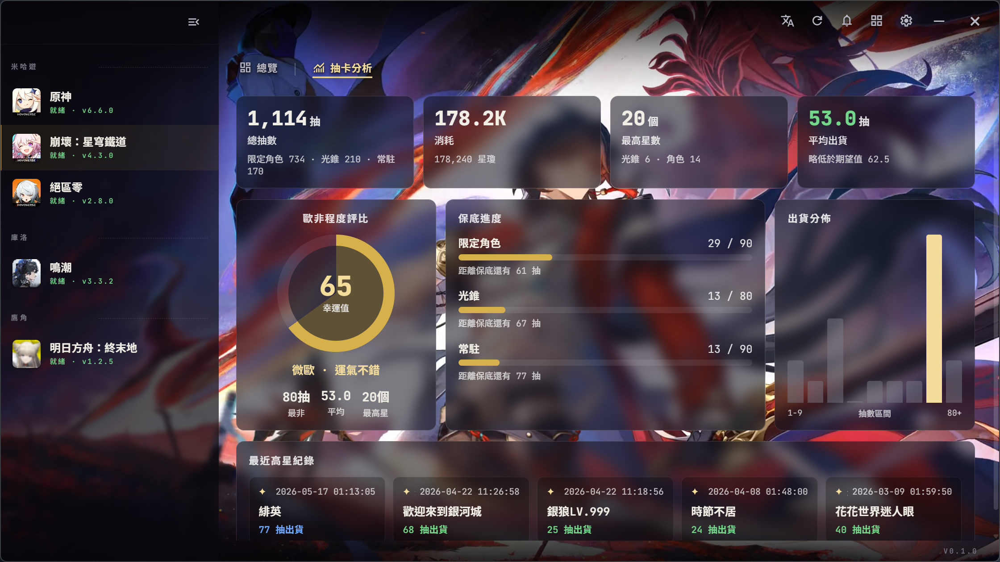

<p align="center">
  
</p>

<h1 align="center">Omnigate</h1>

Unified desktop launcher for several Chinese live-service games (Genshin / Star Rail / Zenless Zone Zero / Wuthering Waves / Endfield / Neverness to Everness).

One library for every launcher: per-game install detection, updates, last-played, latest news, and a per-account **gacha analysis** dashboard (pull totals, premium-currency spent, pity progress, luck rating, pull distribution).

(Originally `launcher-collection`; rebranded to Omnigate post-v0.3.1.)

**Status:** work in progress.

## Screenshots

**Home — game library, key-art & latest news**


**抽卡分析 — per-account gacha dashboard**



**License:** [AGPL-3.0](LICENSE).

**References:**
- Protocol behavior referenced from [Collapse Launcher](https://github.com/CollapseLauncher/Collapse) (AGPL-3.0).
- HDiff patches via bundled [`hpatchz`](https://github.com/sisong/HDiffPatch).

**Design spec:** `docs/superpowers/specs/2026-05-03-launcher-collection-design.md`.

### Sophon protobuf regeneration

The Sophon manifest/patch parsers use generated Go from
`internal/providers/hoyoverse/sophon/proto/*.proto`. The generated
`*.pb.go` files are **committed**, so a fresh checkout builds without `protoc`.

Regenerate only when editing a `.proto`:

```bash
cd internal/providers/hoyoverse/sophon/proto
go install google.golang.org/protobuf/cmd/protoc-gen-go
go generate ./...   # runs: protoc --go_out=. --go_opt=paths=source_relative *.proto
```

Requires `protoc` on PATH. `wails build` does NOT run `go generate`.
